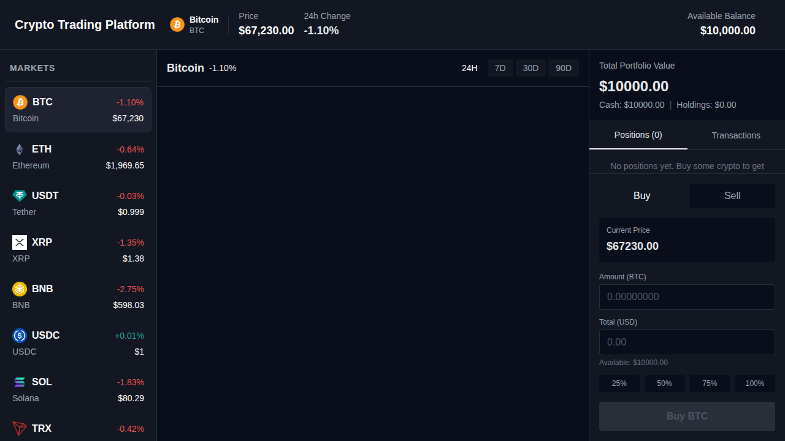

# Crypto Trading Platform

A fully functional cryptocurrency trading platform built with React, TypeScript, and Canvas. Features a professional dark theme, real-time price data, canvas-based charting, portfolio management, and live trading capabilities.



## ✨ Features

### 🎨 **Live Canvas-Based Charting** ⚡
- **Real-time price updates** every 3 seconds - just like TradingView!
- **Animated pulsing indicator** at the current price point
- **Live price line** with dynamic price label
- Custom canvas implementation for high-performance rendering
- Multiple timeframes: 24H, 7D, 30D, 90D
- Interactive crosshair with price tooltips
- Smooth gradient fills and professional styling
- 60 FPS animations for buttery smooth experience
- **See [LIVE_CHART_FEATURES.md](./LIVE_CHART_FEATURES.md) for detailed documentation**

### 💼 **Portfolio Management**
- Real-time portfolio tracking with P&L calculations
- View all your positions with detailed metrics:
  - Amount held
  - Average buy price
  - Current price
  - Profit/Loss percentage
- Complete transaction history
- Persistent storage using localStorage
- Starting balance: $10,000 USD

### 📊 **Live Trading**
- Buy and Sell cryptocurrency with real-time pricing
- Percentage-based quick trade buttons (25%, 50%, 75%, 100%)
- Real-time balance and position updates
- Input validation and error handling
- Trade confirmation alerts
- Support for fractional trading

### 💱 **Cryptocurrency Market Data**
- Top 20 cryptocurrencies by market cap
- **Live price updates** (crypto list: every 10 seconds, chart: every 3 seconds)
- 24-hour price change percentages
- Live pricing via CoinGecko API
- Crypto list includes: BTC, ETH, USDT, XRP, BNB, USDC, SOL, TRX, DOGE, ADA, AVAX, SHIB, TON, LINK, and more

### 🌑 **Professional Dark Theme**
- TradingView-inspired dark color scheme
- Dark backgrounds: #0a0e1a, #131722
- Accent colors: Green (#26a69a) for gains, Red (#ef5350) for losses
- Smooth scrollbars and polished UI
- Responsive layout

## 🚀 Getting Started

### Prerequisites
- Node.js (v16 or higher)
- npm or yarn

### Installation

```bash
# Install dependencies
npm install

# Start development server
npm run dev

# Build for production
npm run build

# Preview production build
npm run preview
```

The application will be available at `http://localhost:5173`

### Development Scripts

```bash
npm run dev          # Start development server
npm run build        # Build for production
npm run preview      # Preview production build
npm run lint         # Run ESLint
npm run type-check   # Run TypeScript type checking
```

## 📁 Project Structure

```
src/
├── components/
│   ├── CanvasChart.tsx      # Canvas-based price chart with interactive features
│   ├── CryptoList.tsx       # Cryptocurrency list sidebar (20 coins)
│   ├── Header.tsx           # Top navigation with portfolio summary
│   ├── Portfolio.tsx        # Portfolio manager with positions & transactions
│   └── TradePanel.tsx       # Buy/Sell trading interface
├── services/
│   └── coinGeckoApi.ts      # CoinGecko API integration
├── App.tsx                   # Main app with state management
├── main.tsx                  # Application entry point
└── index.css                 # Global styles & theme
```

## 🎯 Key Features Explained

### Live Canvas Chart
The chart is built with pure HTML5 Canvas for maximum performance and real-time updates:
- **Live updates every 3 seconds** with new price data
- **Animated pulsing dot** showing live activity
- **Live price line** (horizontal dashed line) with current price label
- Custom rendering engine with device pixel ratio support
- Grid lines with price and time labels
- Gradient fills under the price line
- Interactive hover tooltips with crosshair
- Responsive to window resizing
- 60 FPS smooth animations
- See [LIVE_CHART_FEATURES.md](./LIVE_CHART_FEATURES.md) for full details

### Trading System
The platform includes a complete trading system:
- **Buy**: Purchase cryptocurrency with your available balance
- **Sell**: Sell from your existing positions
- **Position Tracking**: Automatic calculation of average buy price for multiple purchases
- **P&L Calculation**: Real-time profit/loss tracking
- **Transaction History**: Complete audit trail of all trades

### Portfolio Sidebar
Shows comprehensive portfolio information:
- Total portfolio value (cash + holdings)
- Individual position details
- Profit/Loss calculations
- Transaction history with timestamps
- Tabs for easy navigation between positions and transactions

## 🔧 Technology Stack

- **Frontend**: React 18 with TypeScript
- **Build Tool**: Vite 5
- **Styling**: TailwindCSS with custom dark theme
- **Charts**: Custom Canvas implementation
- **API**: CoinGecko API v3 (free tier)
- **HTTP Client**: Axios
- **State Management**: React hooks (useState, useEffect, useCallback)
- **Storage**: localStorage for persistence
- **Linting**: ESLint with TypeScript support

## 📊 API Integration

The platform uses the CoinGecko API (free tier):
- `/coins/markets` - Top cryptocurrencies data
- `/coins/{id}/market_chart` - Historical price data
- No API key required for basic usage
- Rate limits: 10-30 calls/minute

**Note**: If you encounter 401 errors from the API, it's due to rate limiting on the free tier. The chart data may not load, but all trading functionality works independently.

## 💾 Data Persistence

All trading data is stored in your browser's localStorage:
- Portfolio balance
- Open positions
- Transaction history
- Data persists across browser sessions

To reset your portfolio, clear your browser's localStorage for the site.

## 🎮 How to Use

1. **Select a Cryptocurrency**: Click on any crypto in the left sidebar
2. **View the Chart**: See price history with different timeframes (24H, 7D, 30D, 90D)
3. **Make a Trade**: 
   - Enter the amount you want to buy/sell
   - Or use quick percentage buttons
   - Click the Buy/Sell button
4. **Track Your Portfolio**:
   - View positions in the right sidebar
   - Check P&L and transaction history
   - Monitor total portfolio value

## 📝 Notes

- This is a **demo/educational** platform - no real trades are executed
- Uses simulated trading with virtual currency ($10,000 starting balance)
- All calculations are performed locally in the browser
- Chart data depends on CoinGecko API availability

## 🤝 Contributing

This project is open for contributions:
- Bug fixes
- Feature enhancements
- UI/UX improvements
- Additional cryptocurrencies
- More chart indicators

## 📄 License

MIT License - feel free to use this project for learning or as a base for your own trading platform.

## 🙏 Acknowledgments

- CoinGecko for cryptocurrency data
- TradingView for design inspiration
- React and TypeScript communities

---

**Happy Trading! 📈💰**
